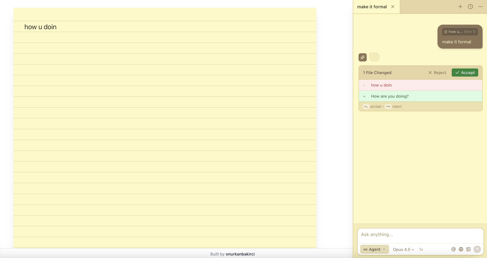

# NotePAI

A beautiful AI-powered notepad with intelligent autocomplete, inline quick edits, and a powerful composer assistant. Write naturally and let AI enhance your notes.

## ✨ Features

### 📝 Smart Autocomplete
- **Tab to complete** - Get intelligent suggestions as you type
- Suggestions appear after a brief pause when cursor is at the end
- Press `Tab` to accept or trigger new completions

### ⚡ Quick Edit (Cmd+K)
- Select text and press `Cmd+K` to open inline edit popup
- Describe how you want to change the selected text
- Review changes with diff preview before accepting
- Smart positioning - popup appears above or below selection based on available space

### 🤖 Composer Assistant (Cmd+I)
- Powerful sidebar chat for complex edits and conversations
- **Multiple modes:**
  - **Agent** - Autonomous AI that can edit your notes directly
  - **Ask** - Get answers without modifying your notes
  - **Plan** - Create detailed task plans
  - **Debug** - Analyze and fix content issues
- **Context-aware** - Select text and press `Cmd+I` to add it as context
- **Diff preview** - Review proposed changes before accepting
- **Chat history** - Access previous conversations with tabs
- **Model selection** - Choose between Opus 4.5, Sonnet 4.5, GPT-5.2, Gemini 3 Flash

## ⌨️ Keyboard Shortcuts

| Shortcut | Action |
|----------|--------|
| `Tab` | Accept autocomplete / Trigger completion |
| `Cmd+K` | Open quick edit popup |
| `Cmd+I` | Open composer / Add selected context |
| `Cmd+Enter` | Accept proposed changes |
| `Cmd+Backspace` | Reject proposed changes |
| `Cmd+T` | New composer tab |
| `Cmd+W` | Close current tab |
| `Esc` | Cancel / Close popup |

---

Built with ❤️ by [onurkanbakirci](https://github.com/onurkanbakirci)
